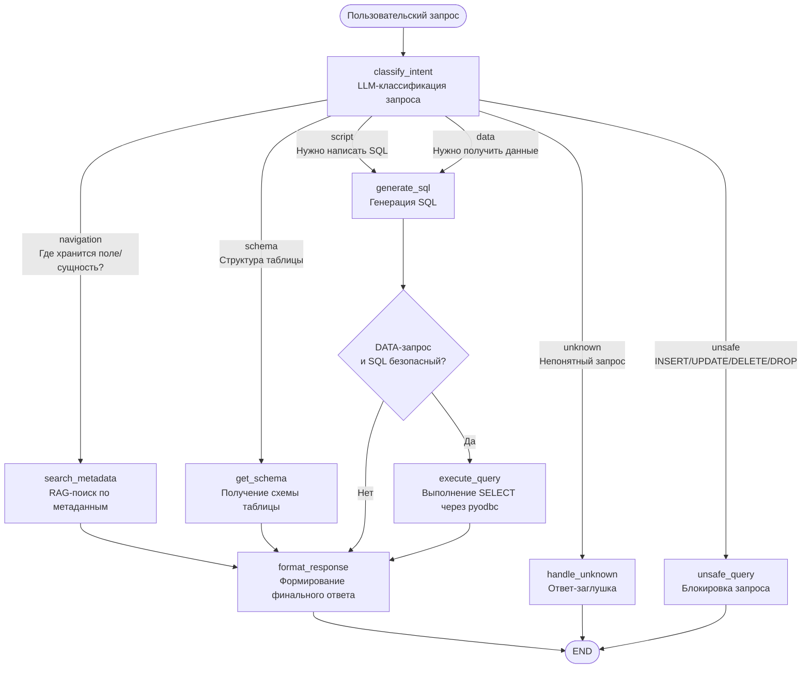

# DB Navigator Agent

## 1. Концепция агента

**DB Navigator Agent** - AI-агент для backend-разработчика, который помогает быстро ориентироваться в MS SQL Server базах данных: находить нужные таблицы и поля, понимать структуру таблиц, генерировать безопасные read-only T-SQL запросы и получать простые ответы из БД.


## 2. Пользователь

Основной пользователь - backend-разработчик, которому часто нужно быстро понять:

- где хранится нужная бизнес-информация;
- какая структура у таблицы;
- как написать безопасный SELECT-запрос;
- какой статус или значение находится в БД по конкретному идентификатору.

## 3. Минимальный LangGraph-каркас

В каркасе реализован стейт, несколько узлов с планируемой логикой, условные переходы и подключенные tools.

### State

Основные поля состояния:

- `user_query` — исходный вопрос пользователя;
- `classification` — тип запроса (результат классификации роутера 1);
- `metadata_result` — найденный контекст по БД (выход RAG-поиска);
- `schema_result` — выход get_table_schema
- `sql_result` — сгенерированный SQL (выход generate_sql);
- `execute_result` — результат выполнения SQL (выход execute_query);
- `tool_results` — история вызовов tools;
- `final_response` — итоговый ответ;

- `sql_validation_status` (добавить в дальнейшем) — результат проверки SQL;

### Узлы графа

- `classify_intent` — определяет тип запроса;
- `search_metadata_node` — ищет таблицы и поля в БД;
- `get_schema` — формирует ответ или SQL;
- `generate_sql` — проверяет, что SQL read-only;
- `execute_query` — выполняет SELECT;
- `format_response` — безопасно отказывает в unsafe-запросах;
- `handle_unknown` — просит уточнение;


### Tools (планируется)

- `metadata_search` — RAG-поиск;
- `schema_tool` — получения структуры таблицы из SQL Server;
- `sql_tool` — выполнения SQL-запросов;

## 4. Схема графа и описание идеи


Граф агента построен как нелинейный workflow на LangGraph.

**Основная идея:**
1. Сначала агент классифицирует пользовательский запрос.
2. Затем выбирает подходящую ветку:
   - `navigation` → RAG-поиск по метаданным БД;
   - `schema` → получение структуры таблицы;
   - `script` → генерация SQL без выполнения;
   - `data` → генерация SQL и, если запрос безопасен, выполнение SELECT;
   - `unsafe` → блокировка запроса;
   - `unknown` → ответ с примерами допустимых запросов.


3. Финальный ответ собирается в `format_response`.

Такой граф показывает две важные инженерные идеи:
- агент принимает решения в зависимости от типа пользовательского запроса;
- выполнение SQL отделено от генерации SQL и разрешается только для безопасных DATA-запросов.

## 5. Edge cases (Заложить)

Ожидаемые edge cases:

1. Пользователь просит изменить данные: `UPDATE`, `DELETE`, `INSERT`.
2. Пользователь задает слишком общий вопрос без названия таблицы или бизнес-термина.
3. Запрошенный бизнес-термин отсутствует в metadata/RAG.
4. SQL сгенерирован, но не проходит валидацию.
5. Запрос к БД не возвращает строк.
6. Есть несколько похожих таблиц-кандидатов, и нужен уточняющий вопрос.
7. Уточняющий вопрос по серверу или БД.

## 6. Критерии качества

Будем считать, что агент работает хорошо, если:

- правильно классифицирует тип запроса;
- находит релевантные таблицы и колонки по бизнес-вопросу;
- не выполняет unsafe SQL;
- генерирует только read-only SQL;
- объясняет, из каких таблиц и полей взят ответ;
- проходит benchmark минимум из 10 тестовых вопросов;
- имеет понятные LangFuse traces и tool-call историю.

## 7. Как запустить demo

```bash
python app.py               — интерактивный режим (REPL)
python app.py "вопрос"      — одиночный запрос
python app.py --test        — прогон тестовых запросов
python app.py --check       — проверка подключений
python app.py --help        — эта справка
```

## 8. Структура проекта

```text
db_navigator/
├── agent/
│   ├── graph.py            # LangGraph граф
│   ├── nodes.py            # логика каждого узла
│   └── state.py            # AgentState (TypedDict)
├── schemes/
│   └── models.py           # pydentic
├── tools/
│   ├── metadata_search.py  # RAG tool
│   ├── schema_tool.py      # get_table_schema
│   └── sql_tool.py         # execute_query
├── rag/
│   ├── indexer.py          # индексация схемы в ChromaDB
│   └── retriever.py        # поиск по вектору
├── llm/
│   ├── llm.py              # обёртка над LLM провайдерами
│   └── prompts.py          # шаблоны промптов для всех LLM-узлов
├── db/
│   └── connector.py        # pyodbc соединения (multi-server)
├── config.py               # серверы, БД, параметры
├── app.py                  # Streamlit UI
├── benchmark/
│   └── test_cases.json     # 10+ тестовых запросов
└── README.md
```

## 9. Что будет расширено дальше

- [x] подключение OpenRouter/Ollama;
- [x] RAG по схеме БД (по sys-таблицам из MS Server);
- [ ] (?) дополнение RAG по документам описания БД;
- [x] реальный `pyodbc` metadata tool;
- [x] read-only SQL  через SQL Server с ограниченными правами;
- [ ] (?) HITL - уточняющие вопросы у пользователя;
- [ ] Retry;
- [ ] LangFuse;
- [ ] benchmark и evals;
- [ ] security-checklist;
- [ ] README.
