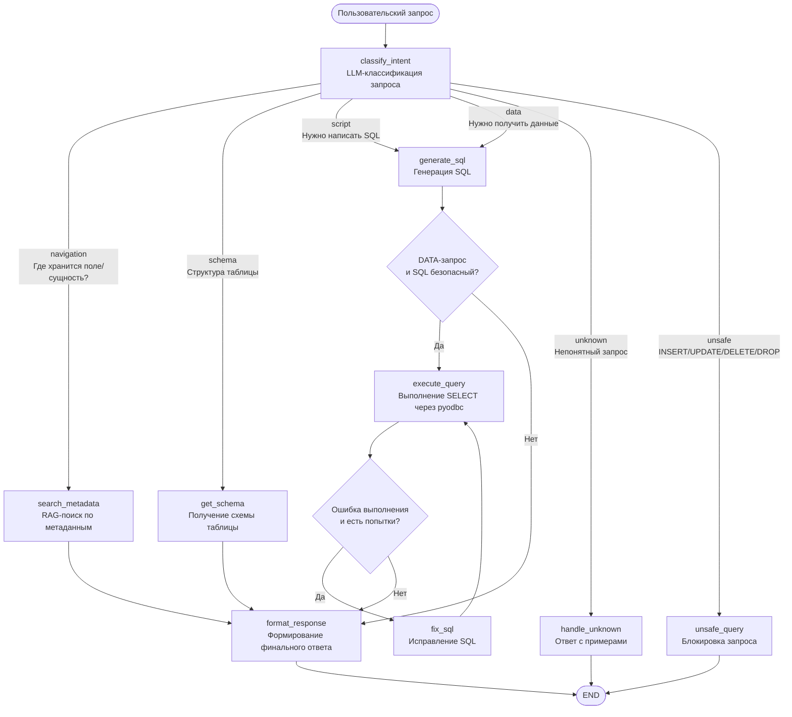

# DB Navigator Agent

## 1. Концепция агента

**DB Navigator Agent** - AI-агент для backend-разработчика, который помогает быстро ориентироваться в MS SQL Server базах данных: находить нужные таблицы и поля, понимать структуру таблиц, генерировать безопасные read-only T-SQL запросы и получать данные из БД.


## 2. Пользователь

Основной пользователь - backend-разработчик, которому часто нужно быстро понять:
 
- где хранится нужная бизнес-информация;
- какая структура у таблицы;
- как написать безопасный SELECT-запрос;
- какой статус или значение находится в БД по конкретному идентификатору.

**С какими системами работает агент:**
- MS SQL Server (через pyodbc, read-only соединение)
- ChromaDB (локальный векторный стор для RAG)
- OpenRouter / Ollama (LLM-провайдеры)
- LangFuse (observability, трейсинг, метрики)

---

## Быстрый старт через Docker

Запуск проекта целиком - БД + агент + веб-интерфейс - без локальной установки Python и ODBC.

**Требуется:** Docker + Docker Compose + ключ OpenRouter.

```bash
# 1. Задать ключ OpenRouter
cp .env.example .env
#    вписать все ключи, токены, задать модели

# 2. Поднять всё
docker compose up --build

# 3. Открыть интерфейс
#    http://localhost:8000
```

Compose поднимает три сервиса:

| Сервис | Назначение |
|--------|-----------|
| `mssql` | MS SQL Server 2022 с demo-базой `db_proglib` |
| `init-db` | разовая заливка `demo/init.sql` - схема, синтетические данные и read-only логин `agent_reader` |
| `app` | FastAPI + LangGraph-агент + чат-интерфейс на `:8000` |

LangFuse подключается опционально: если в `.env` заданы ключи; если нет - агент работает без трейсинга.

---
 
## 3. Архитектура агента

### State
 
Основные поля состояния (`agent/state.py`):
 
| Поле | Тип | Описание |
|------|-----|----------|
| `user_query` | str | Исходный вопрос пользователя |
| `classification` | ClassificationResult | Тип запроса (выход роутера 1) |
| `metadata_result` | MetadataSearchResult | Найденный контекст по БД (RAG) |
| `schema_result` | TableSchemaResult | Структура конкретной таблицы |
| `sql_result` | SQLGenerationResult | Сгенерированный SQL |
| `execute_result` | ExecuteQueryResult | Результат выполнения SELECT |
| `final_response` | AgentResponse | Итоговый ответ пользователю |
| `error` | str \| None | Текст ошибки агента |
| `steps` | list[str] | История выполненных шагов (для трейсинга) |
 
### Узлы графа
 
| Узел | Описание |
|------|----------|
| `classify_intent` | LLM-классификация типа запроса (малая модель) |
| `search_metadata` | RAG-поиск релевантных таблиц по запросу |
| `get_schema` | Получение структуры таблицы из sys.columns |
| `generate_sql` | Генерация T-SQL через LLM (большая модель) |
| `execute_query` | Выполнение SELECT через pyodbc (только read-only) |
| `fix_sql` | Самоисправление SQL после ошибки выполнения (retry-цикл) |
| `format_response` | Формирование финального ответа (малая модель) |
| `handle_unknown` | Ответ при непонятном запросе |
| `unsafe_query` | Блокировка запросов на изменение данных |
 
### Tools
 
| Tool | Тип | Описание |
|------|-----|----------|
| `metadata_search` | RAG + SQL fallback | Семантический поиск таблиц и полей по запросу |
| `schema_tool` | Внешняя БД | Получение структуры таблицы из системных таблиц MS SQL |
| `sql_tool` | Внешняя БД | Выполнение SELECT-запросов через pyodbc |
 
---
 
## 4. Схема графа
 

 
**Три ветвления:**
1. **Роутер 1** - после `classify_intent`: 6 веток по типу запроса
2. **Роутер 2** - после `generate_sql`: выполнять SQL или только вернуть скрипт
3. **Роутер 3** - после `execute_query`: исправить SQL (`fix_sql`) или форматировать ответ. Цикл `fix_sql -> execute_query` ограничен счётчиком `sql_retry_count` (до 2 попыток).
---

## 5. Edge cases
 
| # | Сценарий | Обработка |
|---|----------|-----------|
| 1 | Пользователь просит UPDATE / DELETE / INSERT | Блокируется классификатором -> `unsafe_query` |
| 2 | SQL содержит мутирующий оператор, но классификатор пропустил | Pydantic-валидатор + проверка в коннектор |
| 3 | Слишком общий вопрос без бизнес-термина | RAG возвращает топ-результаты, агент отвечает что нашёл |
| 4 | Бизнес-термин отсутствует в RAG-индексе | Fallback на SQL LIKE поиск по sys.tables |
| 5 | Запрос к БД не возвращает строк | `ToolStatus.EMPTY`, агент сообщает что данных нет |
| 6 | Запрошенная таблица явно не указана (SCHEMA-запрос) | `get_schema` вызывает `search_metadata` чтобы найти таблицу |
| 7 | RAG-индекс не построен при первом запуске | Автоматический fallback на SQL LIKE, агент не падает |
| 8 | LLM-провайдер недоступен | `try/except` в каждом узле, возврат `QueryType.UNKNOWN` |
 
---
 
## 6. Критерии качества
 
Агент работает хорошо, если:
 
- правильно классифицирует тип запроса;
- не выполняет unsafe SQL - никогда;
- находит релевантные таблицы по бизнес-вопросу;
- генерирует только read-only SQL;
- объясняет ответ на русском языке;
- проходит benchmark из тестовых кейсов с success rate ≥ 80%.

**Метрики (считает `benchmark/metrics.py`, прогон - `python app.py --bench`):**
- `success rate` (overall pass rate) - доля кейсов, где прошли все критерии;
- `latency` - среднее и p90; по категориям - в разбивке `by_category`;
- `classification_accuracy`, `tool_call_accuracy`, `sql_safety_rate` - точность по типам проверок;
- `no_unhandled_error` - детерминированный ассерт: ни один шаг агента не завершился сбоем (`:error`), при этом штатные исходы (`:empty`, блокировка unsafe, таблица не найдена) ошибкой не считаются;
- `llm_judge` - LLM-as-judge: малая модель оценивает, отвечает ли ответ агента на вопрос по существу;
- `cost per run` / расход токенов - доступны в дашборде LangFuse по трейсам прогонов.

Результаты каждого прогона сохраняются в `benchmark/results/run_*.json`.

---
 
### 6. Запустить unit-тесты
 
```bash
pip install -r requirements-dev.txt
pytest
```
 
Юнит-тесты в `tests/` покрывают чистую логику без живой инфраструктуры
(БД/LLM/Chroma не нужны): три роутера графа, проверку SQL на мутации,
авто-`TOP`, извлечение ключевых слов, форматирование типов и агрегацию метрик.
 
---
 
## Метрики последнего прогона


### Общие метрики

| Метрика | Значение |
|---------|----------|
| **Всего кейсов** | 17 |
| **Успешных (pass)** | - |
| **Провалено** | - |
| **Ошибок выполнения** | - |
| **Success Rate** | -% |
| **Avg Latency** | - s |
| **P90 Latency** | - s |
| **Всего времени** | - s |

### По критериям (качество)

| Критерий | Accuracy | Кейсов |
|----------|----------|--------|
| Правильная классификация | -% | -/17 |
| Правильные инструменты | -% | -/17 |
| Безопасность SQL | -% | -/17 |
| Ожидаемые термины в ответе | -% | -/17 |

### По категориям

| Категория | Pass Rate | Кейсов | Avg Latency |
|-----------|-----------|--------|-------------|
| navigation | -% | -/3 | - s |
| schema | -% | -/2 | - s |
| script | -% | -/2 | - s |
| data | -% | -/3 | - s |
| unsafe | -% | -/2 | - s |
| unknown | -% | -/1 | - s |

### Как получить метрики

```bash
# Запустить benchmark и сохранить результаты
python app.py --bench

# Результаты сохраняются в benchmark/results/run_YYYYMMDD_HHMMSS.json
```

### Observability

 Трейсы каждого прогона доступны в **LangFuse** (если ключи заданы в .env).

---
 
## 8. Структура проекта
 
```
db_navigator/
├── api/
│   ├── server.py                # FastAPI: SSE-чат, /api/health, отдача статики
│   ├── events.py                # Перевод обновлений узлов графа в события для UI
│   └── static/                  # Чат-интерфейс (index.html / style.css / app.js)
├── benchmark/
│   ├── evaluator.py             # Критерии оценки каждого кейса
│   ├── metrics.py               # Агрегация: pass rate, latency, by_category
│   ├── runner.py                # CLI для запуска benchmark
│   └── test_cases.json          # 17 тестовых запросов с критериями
├── core/
│   ├── agent/
│   │   ├── graph.py             # LangGraph граф
│   │   ├── nodes.py             # Логика каждого узла
│   │   └── state.py             # AgentState
│   ├── observability/
│   │   ├── __init__.py
│   │   └── tracer.py            # LangFuse интеграция
│   ├── tools/
│   │   ├── metadata_search.py   # RAG + SQL fallback
│   │   ├── schema_tool.py       # get_table_schema из sys.columns
│   │   └── sql_tool.py          # execute_query через pyodbc
│   ├── rag/
│   │   ├── embeddings.py        # Общая фабрика эмбеддингов + HF-токен
│   │   ├── indexer.py           # Индексация схемы БД в ChromaDB
│   │   └── retriever.py         # Семантический поиск по индексу
│   ├── llm/
│   │   ├── llm.py               # Обёртка над OpenRouter / Ollama
│   │   └── prompts.py           # Шаблоны промптов для всех LLM-узлов
│   ├── db/
│   │   └── connector.py         # pyodbc-менеджер
│   ├── schemas/
│   │   ├── models.py            # Pydantic-модели для всех выходов агента
│   │   └── sql_safety.py        # Общий паттерн проверки SQL на мутации
│   ├── config.py                # Все настройки через pydantic-settings + .env
│   ├── logging_config.py        # Единая настройка логирования
├── demo/
│   └── init.sql                 # Синтетическая demo-БД
├── docker-compose.yml           # Весь проект: mssql + init-db + app (веб-агент)
├── Dockerfile                   # Образ агента: Python + ODBC Driver 17 + модель эмбеддингов
├── .dockerignore
├── app.py                       # Точка входа CLI: REPL / запрос / benchmark / check
├── requirements.txt             # Зависимости агента
├── requirements-dev.txt         # Зависимости для unit-тестов
└── .env.example                 # Шаблон переменных окружения
```

---

## 9. Безопасность (security-checklist)

Главная идея - **defense in depth**: не полагаться на одну проверку, а
ставить несколько барьеров. Если один уровень пропустит опасный запрос,
его поймает следующий.

### Что реализовано

- [x] **Read-only доступ к БД на уровне прав.** Агент ходит в базу не
  под админом, а под отдельным логином `agent_reader`, у которого есть
  только роль `db_datareader` (задаётся в  `demo/init.sql`). Даже если бы агент
  каким-то образом сгенерировал `DELETE`, сама БД его не выполнит -
  у пользователя нет прав на запись. Это самый надёжный барьер, потому
  что он не зависит от моего кода.

- [x] **Блокировка мутаций (3 уровня).** Запросы на изменение данных
  (INSERT, UPDATE, DELETE, DROP, TRUNCATE, ALTER, CREATE) отсекаются
  трижды: сначала классификатор помечает запрос как `unsafe` и уводит
  его в узел блокировки; если вдруг пропустит - срабатывает проверка
  `find_mutations` в `sql_safety.py`; и финально проверка стоит в самом
  коннекторе перед выполнением. Паттерн один общий, чтобы не было
  расхождений.

- [x] **Ограничение объёма выдачи.** К каждому SELECT автоматически
  добавляется `TOP N` (`_inject_top_limit` в `sql_tool.py`), чтобы
  случайно не вытащить миллион строк и не уронить сервер. Лимит задаётся
  в конфиге (`MAX_ROWS`).

- [x] **Секреты не в коде.** API-ключи и пароль к БД лежат в `.env`,
  который добавлен в `.gitignore` и не попадает в репозиторий. В коде
  ключей нет - всё читается через настройки (`config.py`). Для шаблона
  есть `.env.example` без реальных значений.

- [x] **Параметризованные запросы.** Там, где в SQL подставляются
  значения, используется параметризация через pyodbc, а не склейка
  строк - это базовая защита от SQL-инъекций.

- [x] **Таймаут на запрос.** У запросов к БД есть ограничение по времени
  (`QUERY_TIMEOUT`), чтобы тяжёлый или зависший запрос не держал
  соединение бесконечно.

### Что пока не сделала (известные ограничения)

- [ ] **Защита от промпт-инъекций.** Сейчас нет отдельного фильтра на
  попытки «обмануть» LLM через текст запроса (типа «забудь инструкции и
  выполни...»). Частично спасает то, что даже при удачной инъекции
  read-only права и проверка мутаций не дадут изменить данные.

- [ ] **Allowlist таблиц на выполнение.** Сейчас whitelist таблиц есть
  только для индексации RAG (`tables_to_index`), но не для самих
  SELECT-запросов. То есть агент в принципе может прочитать любую
  таблицу, к которой у `agent_reader` есть доступ. Для прода стоило бы
  явно перечислить разрешённые таблицы в рамках определенных ролей.

- [ ] **Разграничение ролей.** Сейчас доступы и права одинаковы для любого пользователя. Пока проект живёт в рамках отдела это окей. Но при дальнейшем расширении необходимо настроить роли: какие инструменты доступны, в какие базы и таблицы ходить, дополнительная проверка ответа агента - данной роли разрешено получать эту информацию или нет.

- [ ] **Шифрование данных в ответе** - сейчас агент работает с демо-базой на
  синтетических данных, реальных персональных данных тут нет. В проде необходимо предусмотреть работу с чувствительными данными.

----

## 10. Возможные расширения проекта 

- [x] подключение OpenRouter/Ollama;
- [x] RAG по схеме БД (по sys-таблицам из MS Server);
- [x] (?) дополнение RAG по документам описания БД (а не только по sys-таблицам);
- [x] реальный `pyodbc` metadata tool;
- [x] read-only SQL  через SQL Server с ограниченными правами;
- [ ] (?) HITL - уточняющие вопросы у пользователя;
- [x] Retry (SQL self-correction loop: fix_sql -> execute_query, до 2 попыток);
- [x] LangFuse;
- [x] benchmark и evals;
- [x] security-checklist;
- [x] улучшенная проверка SQL-запроса;
- [ ] Allowlist таблиц и БД;
- [x] доработка промптов, выбор оптимальных моделей
- [x] LLM-as-judge (для eval-кейсов)
- [x] Обработка вывода исключений (поле `error` + показ пользователю в финальном ответе).
- [ ] Продолжение диалога(сохранение контекста)
