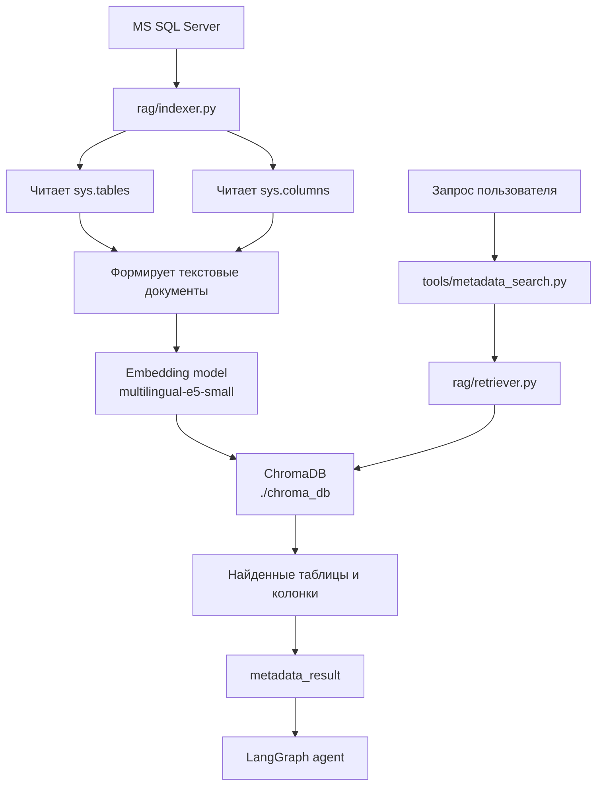
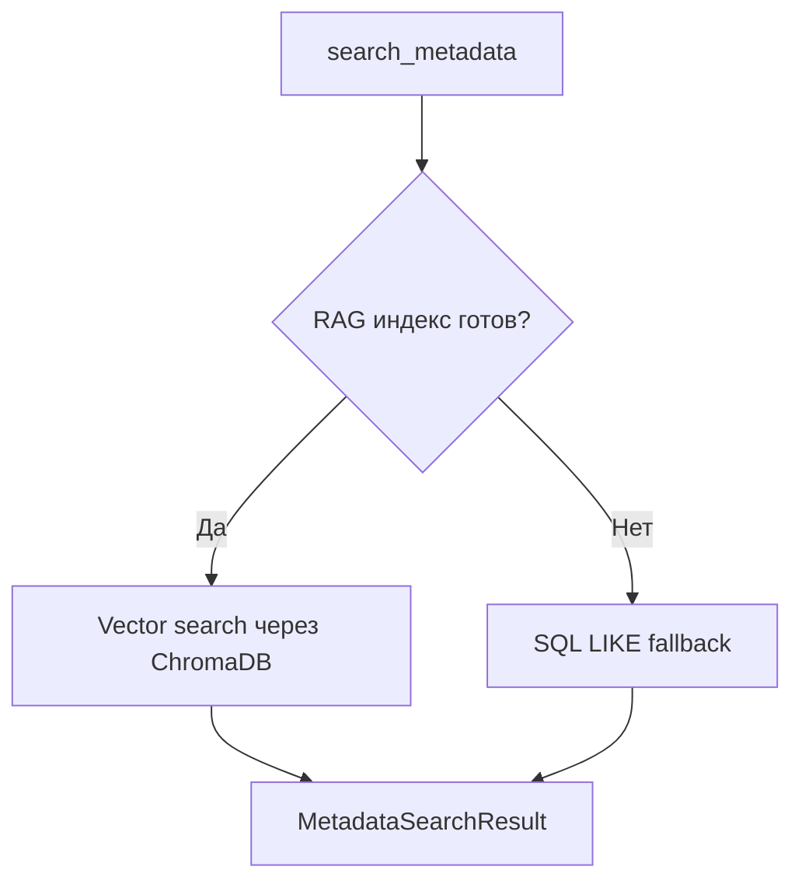
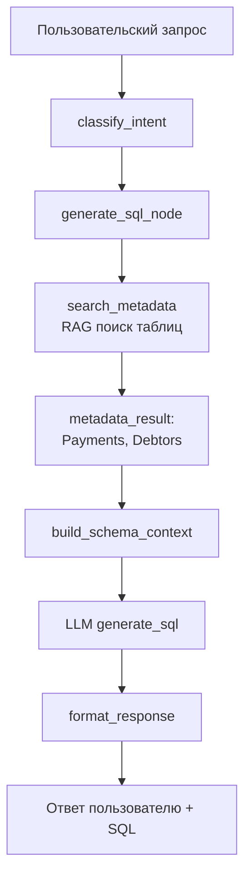
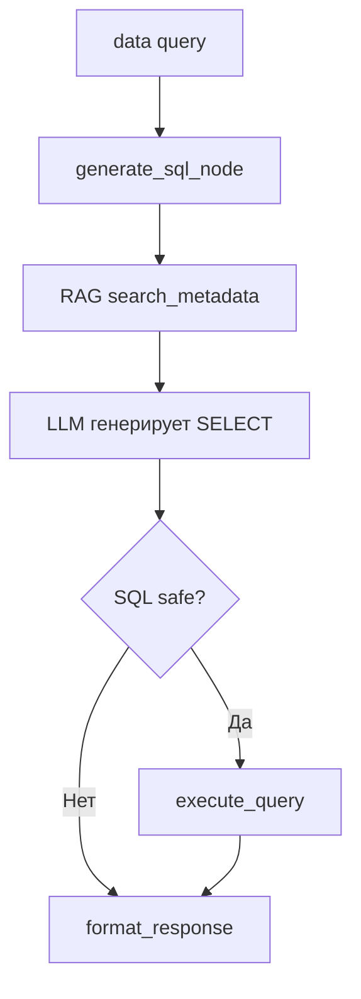

Да. В твоём проекте модуль `rag` отвечает за **поиск релевантных таблиц и колонок по смыслу запроса пользователя**.

Главная идея: пользователь пишет не точное имя таблицы, а обычный вопрос:

```text
Где хранится статус должника?
```

RAG-модуль должен найти, какие таблицы БД больше всего похожи по смыслу на этот запрос.

---

## 1. Важный момент: сейчас это не FAISS, а ChromaDB

В текущем проекте RAG реализован через:

```python
import chromadb
from chromadb.utils.embedding_functions import SentenceTransformerEmbeddingFunction
```

То есть сейчас используется **ChromaDB**, а не FAISS.

По архитектурной роли это всё равно векторный поиск, но технически:

| Компонент         | Сейчас в проекте                     |
| ----------------- | ------------------------------------ |
| Vector Store      | ChromaDB                             |
| Embedding model   | `intfloat/multilingual-e5-small`     |
| Хранилище индекса | папка `./chroma_db`                  |
| Тип поиска        | cosine similarity                    |
| Что индексируется | схема БД: таблицы, описания, колонки |

---

# Общая схема работы RAG



---

# 2. Из каких файлов состоит RAG

В проекте есть два основных файла:

```text
rag/
├── indexer.py
└── retriever.py
```

И ещё важный файл-обёртка:

```text
tools/
└── metadata_search.py
```

Формально `metadata_search.py` не лежит в папке `rag`, но именно через него агент использует RAG.

---

# 3. `rag/indexer.py` — построение индекса

Файл `indexer.py` нужен для **подготовки векторной базы**.

Он делает следующее:

1. Подключается к MS SQL Server.
2. Читает список таблиц из `sys.tables`.
3. Читает колонки каждой таблицы из `sys.columns`.
4. Собирает из схемы БД текстовый документ.
5. Превращает этот документ в embedding.
6. Сохраняет результат в ChromaDB.

То есть `indexer.py` — это не runtime-поиск, а этап подготовки.

---

## Что именно индексируется

Для каждой таблицы создаётся объект `SchemaDocument`:

```python
@dataclass
class SchemaDocument:
    doc_id:      str
    text:        str
    table_name:  str
    server:      str
    database:    str
    description: str
    columns:     str
```

Например, условно для таблицы `Debtors` может получиться такой текст:

```text
Таблица: Debtors
База данных: BankingDB
Сервер: dev
Описание: Информация о должниках

Колонки:
  - DebtorId (int, NOT NULL): Идентификатор должника
  - FullName (nvarchar, NULL): ФИО должника
  - Status (nvarchar, NULL): Текущий статус должника
```

Именно этот текст потом превращается в embedding.

---

## Почему это важно

LLM сама по себе не знает твою БД. Ей нужно дать контекст.

RAG позволяет по запросу:

```text
где хранится статус должника?
```

найти таблицу, где есть колонки вроде:

```text
Status
DebtorStatus
DebtStatus
ClientState
```

Даже если пользователь не назвал точное имя таблицы.

---

# 4. Как запускается индексация

В `indexer.py` есть CLI-запуск:

```bash
python -m rag.indexer
```

А если нужно пересобрать индекс полностью:

```bash
python -m rag.indexer --force
```

Разница:

| Команда                         | Что делает                                                  |
| ------------------------------- | ----------------------------------------------------------- |
| `python -m rag.indexer`         | добавляет только новые таблицы, уже существующие пропускает |
| `python -m rag.indexer --force` | удаляет старую коллекцию и строит индекс заново             |

Это правильный подход для учебного проекта: индекс не пересобирается при каждом запуске агента.

---

# 5. `rag/retriever.py` — поиск по индексу

Файл `retriever.py` отвечает уже за runtime-поиск.

Когда пользователь задаёт вопрос, retriever:

1. Открывает существующий ChromaDB-индекс.
2. Превращает пользовательский запрос в embedding.
3. Ищет похожие документы.
4. Возвращает список `MetadataChunk`.

Основной класс:

```python
class SchemaRetriever:
    def search(self, query: str, top_k: int | None = None) -> list[MetadataChunk]:
        ...
```

---

## Что возвращает retriever

Он возвращает список объектов `MetadataChunk`:

```python
class MetadataChunk(BaseModel):
    table_name:  str
    server:      str
    database:    str
    description: str
    score:       float
    columns:     list[str]
```

Примерно так:

```python
MetadataChunk(
    table_name="Debtors",
    server="dev",
    database="BankingDB",
    description="Информация о должниках",
    score=0.82,
    columns=["DebtorId", "FullName", "Status", "CreatedAt"]
)
```

`score` — это степень похожести результата на запрос пользователя.

---

## Как считается score

ChromaDB возвращает `distance`.

В коде она преобразуется в similarity:

```python
similarity = 1.0 - distance / 2.0
```

То есть:

| Значение | Смысл                               |
| -------- | ----------------------------------- |
| `1.0`    | почти идеальное совпадение          |
| `0.7`    | хороший результат                   |
| `0.3`    | слабый, но ещё допустимый результат |
| `< 0.3`  | отбрасывается                       |

В проекте задан порог:

```python
MIN_SIMILARITY = 0.3
```

Это защита от совсем нерелевантных таблиц.

---

# 6. `tools/metadata_search.py` — tool для агента

Это очень важный файл.

Агент напрямую не вызывает `SchemaRetriever`. Он вызывает tool:

```python
search_metadata(query)
```

А внутри уже происходит:

```python
from rag.retriever import get_retriever
retriever = get_retriever()
```

То есть `metadata_search.py` — это адаптер между LangGraph-агентом и RAG-модулем.

---

## Почему это хороший паттерн

Это правильное разделение ответственности:

| Слой                       | Ответственность                |
| -------------------------- | ------------------------------ |
| `rag/indexer.py`           | построить индекс               |
| `rag/retriever.py`         | искать по индексу              |
| `tools/metadata_search.py` | дать агенту удобный tool       |
| `agent/nodes.py`           | использовать tool внутри графа |

То есть LangGraph не знает деталей ChromaDB. Он просто вызывает tool.

Это production-friendly подход: потом можно заменить ChromaDB на FAISS, Qdrant или pgvector, почти не трогая граф агента.

---

# 7. Fallback: если RAG-индекс не готов

В `metadata_search.py` есть важная логика:

```python
try:
    from rag.retriever import get_retriever
    retriever = get_retriever()

    if retriever.is_ready():
        return _vector_search(retriever, query, top_k)
    else:
        return _sql_fallback_search(query, top_k)

except RuntimeError:
    return _sql_fallback_search(query, top_k)
```

То есть если ChromaDB-индекс ещё не построен, проект не падает.

Вместо этого включается fallback через SQL `LIKE`.

Это полезно для первого запуска проекта.

---

## Основной режим



---

# 8. Где RAG используется в графе агента

В `agent/nodes.py` RAG используется в нескольких местах.

---

## Сценарий 1: `navigation`

Если пользователь спрашивает:

```text
Где хранится статус должника?
```

Классификатор должен определить тип:

```python
QueryType.NAVIGATION
```

Тогда граф идёт в узел:

```python
search_metadata_node
```

Этот узел вызывает:

```python
result = search_metadata(query)
```

И возвращает:

```python
{
    "metadata_result": result,
    "steps": ...
}
```

То есть для navigation RAG — это основной инструмент.

---

## Сценарий 2: `schema`

Если пользователь спрашивает:

```text
Покажи структуру таблицы с платежами
```

Но не указал точное имя таблицы, тогда `get_schema_node` тоже использует RAG:

```python
meta = search_metadata(query, top_k=1)
```

Он берёт самый релевантный результат и уже по нему вызывает:

```python
get_table_schema(server, database, table)
```

То есть RAG помогает определить, какую таблицу имел в виду пользователь.

---

## Сценарий 3: `script` и `data`

В `generate_sql_node` тоже есть использование RAG:

```python
if not current_state.get("metadata_result"):
    meta = search_metadata(query, top_k=3)
    if meta.chunks:
        current_state["metadata_result"] = meta
```

Это значит:

* пользователь просит SQL;
* агент сначала ищет релевантные таблицы;
* затем передаёт найденную схему в LLM;
* LLM генерирует SQL уже не вслепую, а с контекстом таблиц и колонок.

Это правильная RAG-логика.

---

# 9. Как RAG помогает генерации SQL

В `llm/prompts.py` есть функция:

```python
build_schema_context(state)
```

Она берёт `metadata_result` и превращает найденные таблицы в текстовый контекст для LLM.

Примерно так:

```text
Найденные таблицы (по поиску):
  Таблица: Debtors [BankingDB]
  Описание: Информация о должниках
  Колонки: DebtorId, FullName, Status, CreatedAt

  Таблица: Payments [BankingDB]
  Описание: Платежи должников
  Колонки: PaymentId, DebtorId, Amount, PaymentDate
```

Потом этот контекст вставляется в prompt:

```python
GENERATE_SQL_USER = """
Запрос пользователя:
{query}

Контекст схемы БД (доступные таблицы и колонки):
{schema_context}

Напиши T-SQL запрос.
"""
```

Именно это и есть RAG в твоём агенте:

```text
Retrieve → найденные таблицы
Augment → добавили их в prompt
Generate → LLM сгенерировала SQL
```

---

# 10. Как это выглядит в полном агентском сценарии

Например, пользователь спрашивает:

```text
Напиши SQL для вывода последних платежей должника
```

Граф работает так:



Если это `data`-сценарий, после генерации SQL добавляется выполнение:



---

# 11. Что хорошо сделано в текущем RAG-модуле

В проекте есть несколько хороших решений.

## 1. Индексация отделена от поиска

`indexer.py` строит индекс.

`retriever.py` только ищет.

Это правильное разделение.

---

## 2. Есть persistent storage

Индекс хранится в:

```python
settings.chroma_persist_dir
```

По умолчанию:

```python
./chroma_db
```

То есть при каждом запуске приложения не нужно заново читать всю БД.

---

## 3. Используется multilingual embedding model

```python
intfloat/multilingual-e5-small
```

Это хорошо для твоего проекта, потому что запросы у тебя на русском, а названия таблиц/колонок могут быть на английском.

---

## 4. Есть fallback на SQL LIKE

Если индекс не построен, агент не ломается.

Он просто использует более простой поиск по системным таблицам.

---

## 5. RAG не завязан напрямую на LangGraph

Граф вызывает tool `search_metadata`, а не ChromaDB напрямую.

Это упростит замену ChromaDB на FAISS, если понадобится.

---

# 12. Что можно улучшить

Есть несколько мест, которые я бы отметил.

## 1. Несоответствие с FAISS

Если преподавателю ты хочешь показать именно FAISS, текущая реализация не подойдёт, потому что сейчас используется ChromaDB.

Можно либо:

* оставить ChromaDB и сказать, что это vector store;
* заменить ChromaDB на FAISS;
* сделать README честным: “в текущей версии используется ChromaDB, FAISS может быть подключён как альтернатива”.

---

## 2. В `indexer.py` комментарий говорит ChromaDB, это честно

В начале файла написано:

```text
Индексация схемы БД в ChromaDB.
```

То есть код сам явно показывает, что это ChromaDB.

---

## 3. Нет отдельного качества RAG

Сейчас можно добавить небольшой benchmark именно для RAG:

```text
input: "где хранится статус должника?"
expected_table: "Debtors"
```

Это поможет показать преподавателю, что RAG проверяется не только вручную.

---

## 4. Индексируются таблицы как один chunk

Сейчас одна таблица = один документ.

Для учебного проекта это нормально.

Но в большой production-БД таблицы с сотнями колонок лучше разбивать:

```text
table-level chunk
column-group chunk
business-description chunk
```

На текущем этапе усложнять не нужно.

---

# 13. Простое объяснение для README

Можно вставить такое описание:

```markdown
## RAG-модуль

RAG используется для поиска релевантных таблиц и колонок по естественному запросу пользователя.

На этапе индексации модуль `rag/indexer.py` читает метаданные MS SQL Server из `sys.tables`, `sys.columns` и `MS_Description`, формирует текстовое описание каждой таблицы и сохраняет его в локальный vector store ChromaDB.

На этапе выполнения запроса модуль `rag/retriever.py` ищет наиболее похожие таблицы по смыслу пользовательского вопроса. Результаты возвращаются в виде `MetadataChunk`: имя таблицы, сервер, база данных, описание, список колонок и score релевантности.

Агент использует RAG через tool `search_metadata`. Этот tool применяется в сценариях:
- `navigation` — чтобы найти, где хранится нужная информация;
- `schema` — чтобы определить таблицу, если пользователь не указал точное имя;
- `script` и `data` — чтобы добавить найденные таблицы и колонки в prompt генерации SQL.

Если векторный индекс ещё не построен, `search_metadata` автоматически использует fallback через SQL LIKE поиск по системным таблицам.
```

---

Главное: **RAG в твоём проекте нужен не для поиска по PDF-документам, а для поиска по схеме базы данных**. Он помогает агенту понять, какие таблицы и колонки релевантны запросу пользователя, а затем эти найденные метаданные используются для генерации SQL или ответа на вопрос “где это хранится?”.
